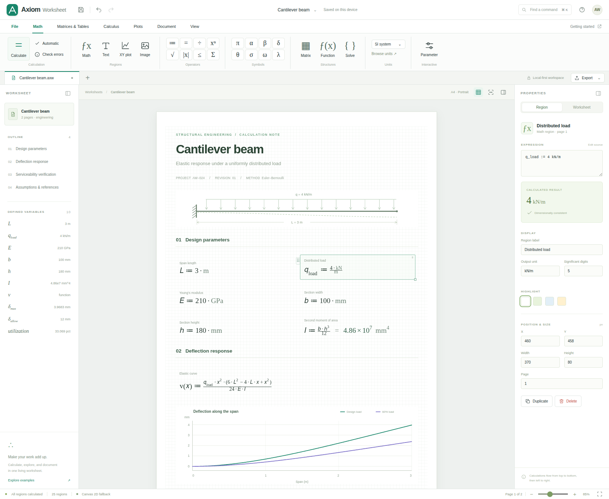

# Axiom Worksheet

**A readable engineering worksheet, with a real calculation engine.**

Axiom Worksheet 0.1.0 is an independent, Mathcad-inspired application built with plain HTML, CSS and JavaScript. It has an editable, paginated worksheet, a dimensional numerical kernel, native MathML equations, and WebGPU plot/page rendering with an automatic Canvas 2D fallback. It has no framework, CDN, account, server API, telemetry or runtime package dependencies.

This is a working initial implementation, **not complete Mathcad feature parity or a Mathcad file-compatibility layer**. The exact boundaries and validation evidence are below.



## Run immediately

The supplied `index.html` is the complete, self-contained application. No build or package installation is required. For predictable origin, worker and storage behavior, serve the folder locally:

```sh
cd axiom-worksheet
python3 -m http.server 8080 --bind 127.0.0.1
```

Open **http://localhost:8080/**. On Windows, `py -m http.server 8080 --bind 127.0.0.1` is an equivalent launcher. `start.sh` and `start.cmd` are also supplied.

You can also open `index.html` directly. Browser restrictions on local files may disable workers or storage; Axiom provides computation and rendering fallbacks. WebGPU requires a supporting browser and a secure context; use localhost for development and HTTPS for hosting. The status bar reports the backend actually in use. `?renderer=canvas` explicitly selects the fallback. See the browser references at the end of this document.

For static hosting, publish just `dist/index.html`. No server-side code is required. The app is supplied as files; it has not been deployed to a public hosting service.

## What works

| Area | Implemented behavior |
|---|---|
| Worksheet | Multiple A4-proportioned pages; free-position math, text, plots, sliders, raster images and an annotated beam diagram; navigator and definitions list. |
| Editing | Double-click expression/text editing; source autocomplete; drag, grid snap, resize, multi-selection, copy/cut/paste, duplicate, delete, alignment, keyboard nudge and undo/redo. |
| Mathematics | Safe Pratt parser, variables and user functions, arithmetic, comparisons, lazy conditionals, ranges, statistics and dimensional quantities. |
| Units | Seven SI base dimensions; SI/derived/imperial unit scales; compound units; dimensional errors; separate output-unit conversion and significant-digit formatting. |
| Linear algebra | Rectangular real matrices, true matrix multiplication, transpose, determinant, inverse, pivoted LU solve, dot product and elementwise operations. |
| Calculus | Adaptive Simpson integration, five-point numerical differentiation, bracketed bisection root finding, rule-based symbolic differentiation and simplification. |
| Plots | Up to eight sampled XY traces, units on axes, editable bounds, labels, resolution, hover readout, clipping and live parameter-slider updates. |
| Persistence | Native versioned `.axw` JSON, open/save, local-storage autosave with failure reporting, and validated import. |
| Exchange | Numeric CSV import; result/source CSV export; selected-plot SVG export; self-contained read-only HTML reports; browser print / Save as PDF. |
| UI | Mathcad Prime-inspired ribbon organization, command palette, region inspector, unit/function browsers, matrix/root dialogs, page zoom and view controls. |

The equations are rendered as native MathML. Editing opens a source textarea; **this is not Mathcad's structured two-dimensional equation-caret editor**. The visual design is independent, not a pixel-identical copy, and includes no PTC assets.

## Start with a real calculation

The default two-page cantilever worksheet contains linked dimensions, load, section properties, a deflection function, a two-trace plot and a serviceability comparison. Double-click the span region and change `L := 3 m` to `L := 4 m`; commit with Enter. Dependent equations and the plot recalculate. Undo restores the calculation and layout together.

Its initial example gives a tip deflection of approximately **3.968253968 mm** for the values in the worksheet. This is a regression-test fixture, not an independently certified design check. The example assumes the stated idealized, linear Euler–Bernoulli beam model.

Open the Axiom brand menu to switch to **Numerical sandbox**. It demonstrates LU solving, calculus, symbolic differentiation and a second-page plot driven by amplitude/frequency sliders. A blank worksheet is also included. Native editable example files are in `examples/`.

## Expression language

Enter each definition in a separate math region, above its consumers:

```text
L := 3 m
q_load := 4 kN/m
E := 210 GPa
b := 100 mm
h := 180 mm
I := b*h^3/12
v(x) := q_load*x^2*(6*L^2 - 4*L*x + x^2)/(24*E*I)
v(L) -> mm
```

More standalone expressions:

```text
sin(30 deg)
25.4 mm -> in
5 kg * 2 m / s^2 -> N
mean([1,2,3,4])
stdev([1,2,3])
sum(1..10)
sum(range(0,1,0.1))
if(2 > 1, 42, 1/0)

A_mat := [4,1;2,3]
b_vec := [9;13]
lsolve(A_mat,b_vec)
det(A_mat)
inv(A_mat)
A_mat'
A_mat[0,1]
hadamard(A_mat,A_mat)

integrate(sin(x),x,0,pi)
root(x^3-x-2,x,1,2)
deriv(sin(x),x,0)
deriv(sin(x/mm),x,0 m,0.001 mm)
diff(x^3 + sin(x),x)
simplify(2*x + 0)
```

### Semantics that matter

Definitions use `:=`; an optional trailing `=` requests evaluation. `->` selects a display unit. The inspector's output-unit field takes precedence when it is set. Identifiers are case-sensitive; `_` creates a typographic subscript. Greek identifiers and supported Unicode operators are accepted.

Regions evaluate in **page, vertical-position, horizontal-position** order. Moving a definition below a consumer changes its scope. User functions capture the environment at their definition position. Upstream edits still invalidate dependent closures when the document recalculates; later redefinitions do not retroactively change an earlier closure.

All numbers are JavaScript binary64 real values. Units are retained internally in SI dimensions. Angles are dimensionless quantities with scale factors. Matrices have a single shared dimension for all entries, not heterogeneous per-cell units. Indices are zero-based (`ORIGIN = 0`). `*` is matrix multiplication; matrix `^` applies an **elementwise** power, not a matrix power. `hadamard` is elementwise multiplication. `stdev`/`std` use sample standard deviation.

`diff` returns a symbolic expression for display; it is not a universal computer algebra system. `root` needs a bracket and a suitable continuous function. Integration and finite differences have method-dependent limitations. Plot sampling is uniform, not a proof of behavior between samples. Invalid finite-domain samples create gaps, but unsampled discontinuities can still be missed.

## Architecture

| Module | Responsibility |
|---|---|
| `src/kernel.js` | Lexer, parser, AST evaluation, quantities, dimensional analysis, matrices, calculus, symbolic rules, formatting, MathML, dependency/version caches and plot sampling. |
| `src/document.js` | Versioned schema, input validation, region creation, page constants, examples and transaction/undo model. |
| `src/worker.js` | Persistent kernel behind an ID-tagged message protocol. |
| `src/renderer.js` | Scene mesh generation, clipping, WGSL pipeline, GPU resources and Canvas 2D fallback. |
| `src/app.js` | Region editor, document interaction, worker scheduling, inspectors, commands, persistence and exports. |
| `src/shell.html`, `src/styles.css` | Accessible native controls, ribbon/workspace layout, visual tokens and print layout. |
| `build.mjs` | Dependency-free bundler; embeds all source, styles and the module-worker Blob into a standalone HTML file. |

Rendering is deliberately hybrid. **WebGPU handles page surfaces, worksheet grids and plot geometry. MathML/DOM handles equations, text, axis labels and controls.** Numeric computation and plot sampling run on the CPU in a worker when available; they are not float32 GPU-compute approximations.

The GPU renderer builds an interleaved float32 mesh, reuses a geometrically growing vertex buffer, performs premultiplied-alpha blending, and resolves a 4× MSAA target. It batches visible viewport geometry into one draw call. Redraws are invalidation-driven rather than an idle animation loop. Geometry is clipped before tessellation. A Canvas 2D implementation consumes the same logical scene commands. The UI exposes actual backend and CPU submission diagnostics; submission duration is not GPU execution time or an FPS benchmark.

See [Architecture](docs/ARCHITECTURE.md) for the calculation/cache/worker contracts and [Validation](docs/VALIDATION.md) for evidence and untested paths.

## Build and test

Node.js 20+ is used only for development. There are no npm packages to install.

```sh
npm run build
npm test
# Or both:
npm run validate
```

The included run passed **113 Node tests** and **38 Chromium interaction checks**. Node coverage includes the worker handler executing on real Node background threads, mesh/clipping tests, and standalone-module syntax. The browser run used a restricted, offline DOM harness: it verified the actual editor, native MathML and Canvas 2D fallback, but could not execute browser WebGPU or module-worker startup.

The optional browser suite uses Python Playwright, which is a test dependency, not an application dependency:

```sh
python3 -m pip install playwright
python3 -m playwright install chromium
# Keep the local HTTP server running in another terminal:
python3 tests/browser_e2e.py
```

Set `CHROMIUM_PATH` to a specific browser executable, `AXIOM_BASE_URL` to another app URL, or `AXIOM_HEADED=1` for visible browser testing. `AXIOM_TEST_INLINE=1` selects the offline DOM harness. `AXIOM_SOFTWARE_GPU=1` opts into software-GPU launch flags for isolated test environments; that is not hardware performance validation.

## Scope and release boundaries

This build does **not** implement `.mcd`, `.mcdx` or `.xmcd` compatibility; a general CAS; complex numbers; arbitrary precision; affine °C/°F units; general nonlinear solve blocks; ODE/PDE systems; optimization; symbolic units; 3D/polar plots; Mathcad programming regions; structured 2D caret editing; collaborative editing; or a native desktop host. Text styling is region-level, not a full rich-text word processor. The beam diagram region is an example-specific illustration, not a general drawing/CAD editor.

All math/plot DOM regions are retained; only geometry submission is viewport-culled. Large imported documents still incur DOM, structured-clone and whole-document scan costs. Undo uses bounded-count snapshots (80), not a byte-budgeted journal. Browser storage has origin/quota constraints; save portable files, especially when using images. The kernel and parser have explicit limits, but these are defensive controls, not a proof against all resource-exhaustion inputs. The 5-second hard timeout applies to a worker; synchronous main-thread fallback cannot be forcibly interrupted.

**Not verified in the supplied environment:** browser WebGPU execution, hardware performance, browser Blob-module worker initialization, cross-session native local-storage persistence, operating-system download dialogs and native print/PDF output. Export contents and print styles were checked separately. No performance, numerical-certification or full-product-parity claim is made.

## References

The implementation is independent. These references establish the worksheet interaction model and browser API contracts; they are not source-code dependencies:

- PTC, About Worksheets and Regions: https://support.ptc.com/help/mathcad/r11.0/en/PTC_Mathcad_Help/about_worksheets_and_regions.html
- W3C, WebGPU specification: https://www.w3.org/TR/webgpu/
- MDN, WebGPU API: https://developer.mozilla.org/en-US/docs/Web/API/WebGPU_API
- MDN, secure contexts and localhost: https://developer.mozilla.org/en-US/docs/Web/Security/Defenses/Secure_Contexts

## License

MIT; see `LICENSE`. Axiom Worksheet is not affiliated with PTC or Mathcad.
